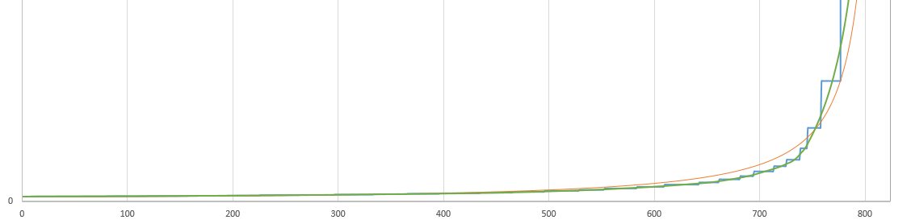

# XFocus 
Custom Auto-Focus for Canon DSLRs with [Magic Lantern](https://magiclantern.fm/) and Raspberry PI.

## Purpose
This project aims to provide sensor-assisted auto-focus for Canon DSLRs models that normally require manual focus-pulling while shooting a scene.
It's still very early in development, but I'm hoping to achieve focus reliability that surpasses the integrated, laser-based auto focus of the newest $3,000 models without the need for an upgrade.

[Posyx](https://www.pozyx.io/) offers anchors and tags which could make this possible,
but they are expensive. Moreover, since 3D positioning is beyond the scope of this project, with only 2 ultra-wideband sensors required,
I'm hoping to develop a custom hardware solution using [sensors provided by DecaWave](https://www.decawave.com/product/dwm1000-module/) and an Arduino.

## Development
In short, the Raspberry PI will drive the Canon DSLR based on wireless communications between the ultra-wideband sensor on the PI and the 2nd sensor on the battery-powered Arduino, telling the camera where to focus.

I've been able to get the Raspberry PI to control the DSLR's lens w/ [`xfocus.py`](xfocus.py) which uses [libgphoto2](https://github.com/gphoto/libgphoto2), 
but I'm still working on calibrating the focus control, since the camera only allows changing focus via steps instead of absolute distance.

Lens calibration data for the Rasperry PI is recorded on the camera itself w/ [`xfocus.lua`](xfocus.lua), 
a [MagicLantern LUA script](https://builds.magiclantern.fm/lua_api/) that records the approximate focus distance of each step as it drives the lens. 
The Rasperry PI then retrieves this data from the camera via the USB connection, 
and interpolates it using a calculus-derived algorithm to meet the middle of each approximate distance.

The orange line shows my first attempt of finding a curve to fit the blue lens data, 
but the green curve of the interpolation algorithm is much better while still resembling a hyperbola.

Due to the uncoupled nature of the aforementioned systems,
this project uses several programming languages including Python on the Raspberry PI, C++ on the Arduino, and [LUA](https://www.lua.org/about.html) on the DSLR for lens calibration.
